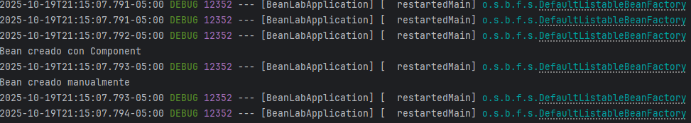
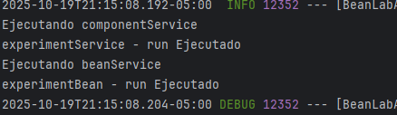
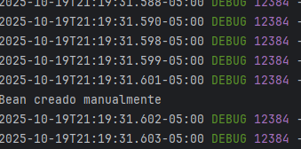
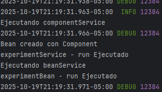

# Taller 1 - Spring Beans

**Curso:** Backend Spring Framework

**Punto 1** Realizado por: Carlos Niño
 

## Objetivo
Analizar el ciclo de vida de cada bean y la diferencia entre  los creados manualmente.

## Desarrollo

1. Crear una clase ExperimentService anotada con @Component que imprima
   mensajes en su metodo constructor.
2. Declarar otro bean manualmente con @Bean dentro de una clase @Configuration,
   puedes nombrar los beans con @Component(“nombreBean”) y
   @Bean(“nombreBean”) para posteriormente utilizarlos con @Qualifier
3. Agregar @Lazy a uno y observa cuándo se ejecuta su inicialización
4. Intercambiar las anotaciones de @Lazy entre cada caso y observa su
   comportamiento.

## Analisis

Al crear los beans utilizando las anotaciones @Component y @Bean, se observa que ambos tipos de beans son gestionados por el contenedor de Spring, pero su ciclo de vida puede variar dependiendo de la configuración.

1. **Ningun bean utilizando la anotacion @Lazy**

    - Ambos beans se inicializan al momento de arrancar la aplicación.
    - El constructor de cada bean se ejecuta inmediatamente, lo que significa que cualquier lógica dentro del constructor se ejecuta en el inicio.
    
    - Inicialización de ambos beans al inicio de la ejecución:
   
    

    - Uso de los beans en el servicio:
   
    

2. **Bean con @Component utilizando @Lazy**

    - El bean anotado con @Component y @Lazy se inicializa solo cuando es solicitado por primera vez.
    - El constructor del bean con @Lazy no se ejecuta al inicio, sino cuando se accede al bean por primera vez.
    
    - Inicialización del bean @Bean al inicio :
   
    

    - Inizialización del bean @Component al ser solicitado:
   
    
3. **Bean con @Bean utilizando @Lazy**

    - El bean anotado con @Bean y @Lazy se comporta de manera similar al caso anterior.
    - El constructor del bean con @Lazy no se ejecuta al inicio, sino cuando se accede al bean por primera vez.
    
    Su comportamiento es idéntico al del bean con @Component y @Lazy, por lo cual no se incluiran las imagenes de la ejecucion.

## Conclusión

El uso de la anotación @Lazy permite optimizar el rendimiento de la aplicación al retrasar la inicialización de los beans hasta que sean realmente necesarios. Esto es especialmente útil en aplicaciones con muchos beans o en situaciones donde algunos beans pueden no ser utilizados en todas las ejecuciones.